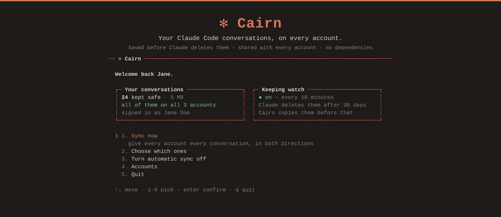

<div align="center">



<br><br>

# Cairn

**Claude Code konuşmalarınız, her hesapta.**<br>
Claude onları silmeden önce kaydedilir, giriş yaptığınız her hesapta karşınıza çıkar.

<br>

[](LICENSE)
[](https://claude.com/claude-code)
[](#-where-your-data-goes)
[](#-where-your-data-goes)
[](#-beta)

🇬🇧 [English](README.md) · 🇫🇷 [Français](README.fr.md) · 🇹🇷 Türkçe · 🇦🇿 [Azərbaycanca](README.az.md)

</div>

<br>

---

## 🎯 Neden

Başka bir Claude hesabına giriş yaptınız ve konuşmalarınız kayboldu.

**Kaybolmadılar.** Diskinizde, tam da bıraktığınız yerdeler. Claude her hesap
için ayrı bir liste tutuyor ve siz başka bir yerden giriş yaptıktan sonra yanlış
listeyi okuyor.

Bir de daha sessiz ve daha kötü olan ikinci bir sorun var: **Claude Code
konuşmaları 30 gün sonra siliyor.** Varsayılan olarak, size haber vermeden.
Çoğu kişi bunu, istediği bir şey çoktan gittikten sonra fark ediyor.

Cairn ikisini de çözer, sonra yolunuzdan çekilir.

---

## 🚀 Kurulum

### 🪟 Windows — terminale gerek yok

| | |
|---|---|
| **1** | [**⬇ `Cairn.cmd` dosyasını indirin**](https://github.com/veax-project/claude-cairn/releases/download/v1.0.0-beta.1/Cairn.cmd) — tarayıcınız dosyayı saklamak isteyip istemediğinizi sorabilir. Saklayın. |
| **2** | Dosyaya **çift tıklayın**. |
| **3** | **`1`** tuşuna basın, birkaç saniye bekleyin. |
| **4** | **Claude'dan tamamen çıkın**, sonra yeniden açın. |

Bitti. Konuşmalarınız kenar çubuğuna geri geldi.

Bir kez daha çalıştırıp **`3`** tuşuna basın, otomatik eşitleme açılsın; böylece
bir daha bu işle uğraşmanız gerekmez.

### 🍎 macOS / 🐧 Linux

```bash
npx github:veax-project/claude-cairn
```

Aynı ekran, aynı adımlar.

<br>

> ### ⚠️ Sonra Claude'dan çıkıp yeniden açın
> Claude konuşma listesini **yalnızca bir kez, açılışta** okur. Cairn bu listeye
> ekleme yapabilir ama Claude bunu bir sonraki açılışa kadar fark etmez. İnsanların
> "çalışmadı" sanmasının 1 numaralı sebebi budur.

> ### 📦 [Node.js](https://nodejs.org) gerekiyor
> Çoğu geliştiricide zaten var. Sizde yoksa açılan pencere bunu söyler ve sizi oraya
> yönlendirir — **LTS** yazan sürümü kurun, sonra tekrar çalıştırın.

---

## ✨ Ne yapar

- 💾 **Kaydeder.** Her konuşma, Claude'un silmediği bir yere kopyalanır. O kopya sizindir ve hiçbir şey onu kaldırmaz.
- 🔄 **Paylaşır.** Bilgisayarınızdaki her hesap her konuşmayı alır — **iki yönde de**. Bir hesapta başladığınız işi başka bir hesaba geçtiğinizde orada bulursunuz. Geri döndüğünüzde de arada yaptığınız işler orada olur.
- 👁️ **İzler.** Otomatik eşitlemeyi açın; bilgisayarınız açılır açılmaz devreye girer ve ikisini de her on dakikada bir yapar. Bir daha aklınıza bile gelmez.
- 🔎 **Claude'un arama yapmasını sağlar.** Beş dakika önce oluşturduğunuz hesap dahil, her hesaptan.
- ↩️ **Geri alır.** Tek bir komut, yazdığı şeyi tam olarak siler, başka hiçbir şeyi değil.

---

## 🔌 Claude'un kendi geçmişinizde arama yapmasını sağlayın

```bash
npx github:veax-project/claude-cairn install-mcp
```

Claude'u yeniden başlatın, sonra ona şöyle şeyler sorun:

> *eski konuşmalarımda auth hatasını nasıl düzelttiğimizi ara*

<div align="center">

</div>

Bu **her** hesapta çalışır, yepyeni bir hesap dahil. Bütün mesele de bu:
bağlantı bir hesaba değil, bilgisayarınıza aittir.

---

## 🧯 Sorun giderme

| Belirti | Nedeni | Çözüm |
|---|---|---|
| 😐 Hiçbir şey geri gelmedi | Claude zaten açıktı | **Tamamen çıkıp** yeniden açın — listeyi yalnızca açılışta okur |
| 🪟 Pencere anında kapandı | Node.js yok | [nodejs.org](https://nodejs.org) adresinden kurun, **LTS** seçin, dosyayı tekrar çalıştırın |
| 🤷 Bir konuşma hâlâ eksik | Başka bir projeye aitti | Kenar çubuğu projeye göre filtrelenir — o projenin klasörünü açın |
| 🔢 Hesaplar kod olarak görünüyor | Diskinizde kim olduklarını söyleyen hiçbir şey yok | **`4`** tuşuna basıp onlara isim verin; yeni hesaplar adlarını kendileri yazar |
| 😱 İşleri daha da kötüleştirdi | — | `undo` her şeyi tam olarak eski hâline döndürür |
| 🍎 Mac'te hiçbir şey olmuyor | Orada hiç test edilmedi | [Ne olduğunu bize anlatın](https://github.com/veax-project/claude-cairn/issues/new?template=platform_report.md) — düzelmesinin tek yolu bu |

---

## 🛡️ Verileriniz nereye gidiyor

**Hiçbir yere.** Cairn, bilgisayarınızdaki bir klasörden yine bilgisayarınızdaki
başka bir klasöre dosya kopyalar.

- 🚫 **Sıfır bağımlılık.** `package.json` içindeki `dependencies` bölümü boştur.
- 🚫 **Sıfır ağ isteği.** Telemetri yok, güncelleme kontrolü yok, analiz yok. **Wi-Fi'nizi kapatın, her komut yine de çalışır** — kendiniz kontrol etmenin en kolay yolu bu.
- 🔌 MCP sunucusu Claude ile standart girdi ve çıktı üzerinden konuşur. Hiçbir soket açmaz.
- 🗑️ Yedeğinizden **hiçbir şey asla silinmez**. Cairn tarafından bile.
- ↩️ `undo` yalnızca kendi yazdığını siler; bunu boyut ve zaman damgasından tanır — Claude'un o zamandan beri dokunduğu hiçbir şeye karışmaz.

<details>
<summary><b>📄 Tam olarak neyi kurduğunuzu görün</b></summary>

<br>

Yaklaşık 3000 satır sade JavaScript; derleme adımı yok, paketleyici yok.
`src/` içinde on bir dosya var ve hepsini okuyabilirsiniz.

Başlatıcı, Node'u kontrol eden, sürüm arşivini indiren ve çalıştıran 90 satırlık
bir `.cmd` dosyasıdır. Tamamen ASCII'dir ve başka hiçbir şey yapmaz.

</details>

---

## 📋 Komutlar

| Komut | Ne yapar |
|---|---|
| `cairn` | Bu sayfanın başındaki ekranı açar |
| `cairn sync` | Her şeyi kaydeder, sonra her hesaba her şeyi verir |
| `cairn autostart on` | Bunu her 10 dakikada bir, açılıştan itibaren yapmayı sürdürür |
| `cairn status` | Burada ne var, ne gizli, ne risk altında |
| `cairn undo` | Son eşitlemenin yazdığı şeyi tam olarak siler |
| `cairn search <kelimeler>` | Her hesapta arama yapar |
| `cairn install-mcp` | Claude'un arşivde kendi başına arama yapmasını sağlar |
| `cairn export` | Her konuşmayı Markdown olarak dışa aktarır |
| `cairn pack` | Konuşmaları bir sohbete eklemek için tek dosyada toplar |

Yedeğiniz `~/ClaudeCairn` içinde durur. `--vault <klasör>` ile ya da
`CAIRN_VAULT` ortam değişkeniyle taşıyabilirsiniz.

---

## 🔬 Nasıl çalışır

<details>
<summary><b>Cairn'i kullanmak için buna ihtiyacınız yok — ama konuşmalarınıza dokunan bir araç kendini açıklayabilmeli</b></summary>

<br>

Claude Code iki ayrı şeyi, iki ayrı yerde tutar:

```
~/.claude/projects/<project>/<id>.jsonl
    konuşmanın kendisi
    cleanupPeriodDays'i aşınca silinir — varsayılan olarak 30 gün

<appData>/Claude/claude-code-sessions/<account>/<org>/local_*.json
    onu listeleyen kenar çubuğu kaydı
    her hesap için ayrı bir klasör; hesap değiştirince her şeyin kaybolma sebebi bu
```

Cairn birincisini güvenli bir yere kopyalar, ikincisini de bulduğu her hesabın
altına yazar. Konuşmalara yalnızca ekleme yapıldığı için, büyümemiş bir dosya
atlanır. Yedekten hiçbir şey asla silinmez — Claude'un çoktan sildiği bir
konuşma orada kalır, çünkü artık o kopya var olan tek kopyadır.

Claude her kenar çubuğu kaydını listelemeden önce katı bir biçime göre denetler
ve uymayan her şeyi sessizce eler. Cairn bu kayıtları gerçek dosyalarda
gözlemlenen biçime göre oluşturur: **zaman damgaları metin yerine sayı olarak**,
fazladan alan yok ve transkriptlerde ara sıra beliren yer tutucu değerlerin
hiçbiri yok.

Arama dizini, Node'un içinde hazır gelen SQLite'ın tam metin aramasını kullanır.
Hiç bağımlılık olmamasının sebebi de bu.

</details>

---

## ⚠️ Beta

İlk sürüm. Windows'ta baştan sona doğrulandı: **haftalardır görünmeyen 23
konuşma**, yeniden başlatmanın ardından kenar çubuğuna geri geldi ve Cairn'in
yazdığı her kayıt kabul edildi.

21 otomatik test var; bunlardan biri, yerleşim hatalarını yakalamak için arayüzü
benzetilmiş bir terminalde yedi farklı pencere boyutunda yeniden çiziyor.

| | |
|---|---|
| ✅ **Kanıtlandı** | Windows |
| ❓ **Hiç çalıştırılmadı** | macOS, Linux — kod yazıldı ve gözden geçirildi, o kadar |
| ❌ **İmkânsız** | İlk yedeğinizden önce Claude'un sildiği konuşmalar. Onları hiçbir şey geri getirmez. |
| ❌ **Kapsam dışı** | Normal claude.ai sohbetleri. Onlar Anthropic'in sunucularında durur ve hesaplar arasında taşınamaz — bu, aracın değil ürünün bir sınırı. |

[Bir konu açın](https://github.com/veax-project/claude-cairn/issues/new/choose) — özellikle de Mac kullanıyorsanız.

---

<div align="center">

**MIT** · Hesap değiştirmek, yaptığınız işe mal olmasın diye yapıldı.

</div>
