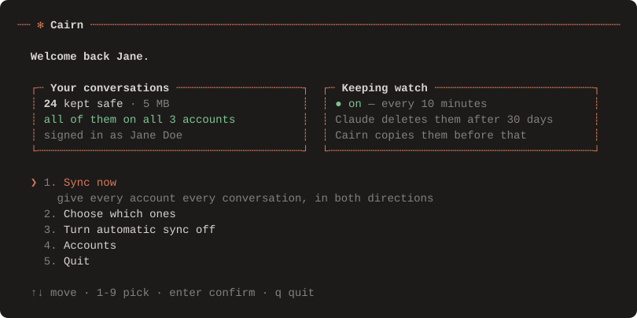
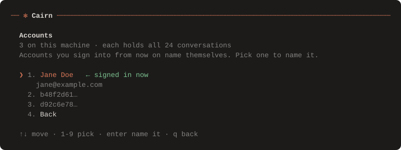

[English](README.md) · [Français](README.fr.md) · [Türkçe](README.tr.md) · [Azərbaycanca](README.az.md)

# Cairn

**Claude Code sohbetleriniz, her hesapta.**

<p align="center">
  
</p>

Başka bir Claude hesabına giriş yaptınız ve sohbetleriniz kayboldu. Aslında
hiçbir yere gitmediler. Cairn onları geri getirir ve bunun bir daha
yaşanmasını engeller.

---

## Kurulum

### Windows

**1.** [**⬇ Cairn.cmd dosyasını indirin**](https://github.com/veax-project/claude-cairn/releases/download/v1.0.0-beta.1/Cairn.cmd) — tarayıcınız dosyayı saklamak isteyip istemediğinizi sorabilir. Saklayın.

**2.** İndirdiğiniz dosyaya **çift tıklayın**.

**3.** Yukarıdaki ekran açılır. **`1`**'e basın ve birkaç saniye bekleyin.

**4.** **Claude'dan tamamen çıkın** ve yeniden açın.

Hepsi bu. Sohbetleriniz kenar çubuğuna geri geldi.

> **Claude'dan neden çıkıp yeniden açmak gerekiyor?** Claude sohbet listesini
> yalnızca bir kez, açılışta okur. Cairn o listeye yazabilir ama Claude bunu
> ancak bir sonraki açılışta fark eder.

Sonra bir kez daha çalıştırın ve otomatik eşitlemeyi açmak için **`3`**'e
basın; böylece bunu bir daha yapmanız gerekmez.

> Cairn'in çalışması için [Node.js](https://nodejs.org) gerekir — çoğu
> geliştiricide zaten vardır. Sizde yoksa pencere bunu söyler ve sizi oraya
> yönlendirir. **LTS** yazan sürümü kurun, sonra Cairn.cmd dosyasına yeniden
> çift tıklayın.

### Mac, Linux ya da terminali tercih ediyorsanız

```bash
npx github:veax-project/claude-cairn
```

Aynı ekran, aynı adımlar.

---

## Sorun nerede

**Hesap değiştirmek geçmişinizi gizler.** Sohbetleriniz hâlâ diskinizde, hiç
dokunulmamış hâlde duruyor. Claude her hesap için ayrı bir liste tutuyor;
başka bir hesapla giriş yaptığınızda yanlış listeyi okuyor, o kadar.

**Üstelik Claude Code sohbetleri 30 gün sonra siliyor.** Hem de varsayılan
olarak ve sessizce; siz hesap değiştirseniz de değiştirmeseniz de. Çoğu kişi
bunu, ihtiyaç duyduğu şey çoktan gitmişken fark ediyor.

---

## Cairn bu konuda ne yapıyor

Üç şey yapar, sonra sizi rahat bırakır.

**Sohbetleri saklar.** Her sohbet, Claude'un silmediği bir yere kopyalanır. O
kopya sizindir; kimse onu kaldırmaz.

**Hepsini paylaştırır.** Bilgisayarınızdaki her hesapta bütün sohbetler
görünür — hem de iki yönlü. Bir hesapta bir işe başlayıp diğerine geçin:
sohbetiniz orada. Geri döndüğünüzde arada yaptığınız iş de orada.

**Göz kulak olur.** Otomatik eşitlemeyi açın; yukarıdaki iki iş, bilgisayarınız
açılır açılmaz başlayarak her on dakikada bir kendiliğinden yapılır. Bir daha
aklınıza bile getirmezsiniz.

---

## Claude kendi geçmişinizde arama yapsın

```bash
npx github:veax-project/claude-cairn install-mcp
```

Claude'u yeniden başlatın, sonra ona şöyle şeyler sorun:

> *auth hatasını nasıl çözdüğümüzü eski sohbetlerimde ara*

Bu, **her** hesapta çalışır; beş dakika önce açtığınız hesapta bile. Zaten
olayın özü bu: bu bağlantı bir hesaba değil, bilgisayarınıza ait. Yani
yepyeni bir hesap bile bugüne kadar yaptığınız her şeye ulaşabilir.

<p align="center">
  
</p>

---

## İnsanların sorduğu sorular

**Verilerim nereye gidiyor?**

Hiçbir yere. Cairn, bilgisayarınızdaki bir klasörden yine bilgisayarınızdaki
başka bir klasöre dosya kopyalar. Bağımlılık yok, telemetri yok, güncelleme
kontrolü yok, ağa çıkan tek bir istek bile yok — Wi-Fi'ınızı kapatın, bütün
komutlar yine çalışır. Kendiniz doğrulamanın en kolay yolu da bu.

**Ya bir şeyi bozarsa?**

```bash
npx github:veax-project/claude-cairn undo
```

Bu komut, son eşitlemenin eklediği ne varsa onu kaldırır; başka hiçbir şeye
dokunmaz. Kendi dosyalarını boyutlarından ve zaman damgalarından tanır, yani
Claude'un o zamandan beri elinin değdiği hiçbir şeye karışmaz. Yedeğinizden
ise asla bir şey silinmez.

**Bazı hesaplarım neden isim yerine bir kodla görünüyor?**

Çünkü bilgisayarınızda o hesapların kime ait olduğunu söyleyen hiçbir şey yok.
Claude yalnızca şu anda giriş yapmış olduğunuz hesabın adını söylüyor; Cairn de
her çalıştığında o ismi bir kenara yazıyor. Bundan sonra kullanacağınız her
hesap, ilk girişinizde kendi adını vermiş olacak. Eskiler içinse **4**'e basıp
isimleri elle yazabilirsiniz — listede her hesabın ilk sohbeti ve o hesabı en
son ne zaman kullandığınız yazıyor; genelde hatırlamanıza yetiyor.

**Mac veya Linux'ta çalışıyor mu?**

Dürüstçe söyleyeyim: bilmiyoruz. Cairn Windows'ta geliştirildi ve orada
doğrulandı. Mac ve Linux tarafının kodu yazıldı, gözden de geçirildi ama
gerçek bir makinede hiç çalıştırılmadı. Denerseniz,
[başınıza geleni bize anlatın](https://github.com/veax-project/claude-cairn/issues/new?template=platform_report.md)
— düzelmesinin tek yolu bu.

**Bu, normal Claude sohbetlerim için de işe yarıyor mu?**

Hayır. Yalnızca Claude Code. Normal sohbetler Anthropic'in sunucularında
duruyor ve hesaplar arasında taşınamıyor — bu, aracın değil ürünün sınırı. Bir
hesabı bırakmadan önce *Settings → Privacy → Export Data* yolunu kullanın.

**Eski sohbetleri yeni bir hesabın sohbet geçmişine koyabilir mi?**

Claude Code için evet — zaten tam olarak yaptığı şey bu. Normal sohbetler
içinse hayır; başka hiçbir şey de yapamaz: bir Claude hesabına geçmişte
verilmiş bir cevabı yazmanın yolu yok. Aksini iddia eden araçlar, sohbetin
sizin tarafınızı yeniden gönderip Claude'a baştan cevap verdiriyordur.

---

## Komutlar

| Komut | Ne yapar |
|---|---|
| `cairn` | Bu sayfanın başındaki ekranı açar |
| `cairn sync` | Her şeyi saklar, sonra her hesaba her şeyi verir |
| `cairn autostart on` | Bunu açılıştan itibaren her 10 dakikada bir sürdürür |
| `cairn status` | Neler var, neler gizli, neler risk altında |
| `cairn undo` | Son eşitlemenin yazdığı şeyi geri alır |
| `cairn search <words>` | Bütün hesaplarda arama yapar |
| `cairn install-mcp` | Claude'un arşivde kendi başına arama yapmasını sağlar |
| `cairn export` | Bütün sohbetleri Markdown olarak dışa yazar |
| `cairn pack` | Sohbetleri, bir sohbete ekleyebileceğiniz tek dosyada toplar |

Yedeğiniz `~/ClaudeCairn` içinde durur. Başka bir yere taşımak için
`--vault <folder>` seçeneğini ya da `CAIRN_VAULT` ortam değişkenini kullanın.

**Gereksinimler:** Node 22.16 veya üzeri. Başka hiçbir şey — Cairn'in hiç
bağımlılığı yok.

---

## Nasıl çalışıyor

*Cairn'i kullanmak için bunları bilmenize gerek yok. Burada olmalarının sebebi
şu: sohbetlerinize dokunan bir araç, kendini açıklayabilmeli.*

Claude Code iki ayrı şeyi, iki ayrı yerde tutuyor:

```
~/.claude/projects/<project>/<id>.jsonl
    sohbetin kendisi
    cleanupPeriodDays değerinden eski olunca silinir — varsayılanı 30 gün

<appData>/Claude/claude-code-sessions/<account>/<org>/local_*.json
    onu listeleyen kenar çubuğu kaydı
    her hesap için ayrı klasör; hesap değiştirince her şey bu yüzden kayboluyor
```

Cairn birincisini güvenli bir yere kopyalar, ikincisini de bulduğu her hesabın
altına yazar. Sohbetlere yalnızca ekleme yapılır, o yüzden büyümemiş bir dosya
atlanır; yedekten de asla bir şey çıkarılmaz — Claude'un çoktan sildiği bir
sohbet orada kalır, çünkü artık var olan tek kopya odur.

Claude her kenar çubuğu kaydını listelemeden önce katı bir kalıba göre
denetliyor ve uymayan her şeyi sessizce eliyor. Cairn bu kayıtları gerçek
dosyalarda gözlemlenen kalıba göre üretir: zaman damgaları metin değil sayı
olarak, fazladan tek bir alan olmadan ve kayıtlarda ara sıra beliren yer
tutucu değerler kullanılmadan.

Arama dizini, Node'un içinde hazır gelen SQLite'ın tam metin aramasını
kullanıyor. MCP sunucusu Claude ile standart girdi ve çıktı üzerinden
konuşuyor, hiçbir soket açmıyor.

---

## Beta

Bu ilk sürüm. Windows'ta baştan sona doğrulandı: haftalardır görünmeyen 23
sohbet, yeniden başlatmanın ardından kenar çubuğuna geri geldi ve Cairn'in
yazdığı kayıtların hepsi kabul edildi.

21 otomatik test var; bunlardan biri, yerleşim hatalarını yakalamak için
arayüzü yedi farklı pencere boyutunda simüle edilmiş bir terminale yeniden
çiziyor.

**Kanıtlanmamış olan:** macOS ve Linux. Ayrıca Claude'un ilk yedeğinizden önce
sildiği sohbetler gitmiştir — onları hiçbir şey geri getiremez.

Bir sorunla mı karşılaştınız? [Issue açın](https://github.com/veax-project/claude-cairn/issues/new/choose).

---

MIT
